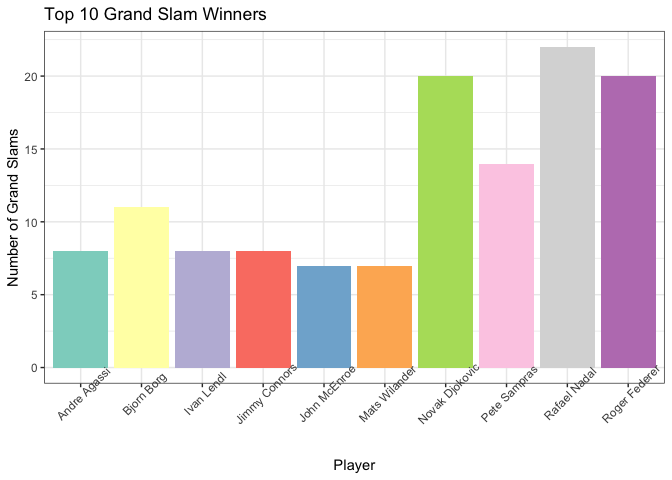

# Purpose

I’ve included my thought process into how I approached this project.

``` r
rm(list = ls()) # Clean your environment:
gc() # garbage collection - It can be useful to call gc after a large object has been removed, as this may prompt R to return memory to the operating system.
```

    ##          used (Mb) gc trigger (Mb) limit (Mb) max used (Mb)
    ## Ncells 465667 24.9     995821 53.2         NA   669311 35.8
    ## Vcells 867824  6.7    8388608 64.0      16384  1840062 14.1

``` r
library(tidyverse)
```

    ## ── Attaching core tidyverse packages ──────────────────────── tidyverse 2.0.0 ──
    ## ✔ dplyr     1.1.2     ✔ readr     2.1.4
    ## ✔ forcats   1.0.0     ✔ stringr   1.5.0
    ## ✔ ggplot2   3.4.2     ✔ tibble    3.2.1
    ## ✔ lubridate 1.9.2     ✔ tidyr     1.3.0
    ## ✔ purrr     1.0.1     
    ## ── Conflicts ────────────────────────────────────────── tidyverse_conflicts() ──
    ## ✖ dplyr::filter() masks stats::filter()
    ## ✖ dplyr::lag()    masks stats::lag()
    ## ℹ Use the conflicted package (<http://conflicted.r-lib.org/>) to force all conflicts to become errors

``` r
library(lubridate)
library(RColorBrewer)
library(vip)
```

    ## 
    ## Attaching package: 'vip'
    ## 
    ## The following object is masked from 'package:utils':
    ## 
    ##     vi

``` r
library(gridExtra)
```

    ## 
    ## Attaching package: 'gridExtra'
    ## 
    ## The following object is masked from 'package:dplyr':
    ## 
    ##     combine

``` r
library(xtable)
library(caret)
```

    ## Loading required package: lattice
    ## 
    ## Attaching package: 'caret'
    ## 
    ## The following object is masked from 'package:purrr':
    ## 
    ##     lift

``` r
library(ranger)
list.files('code/', full.names = T, recursive = T) %>% .[grepl('.R', .)] %>% as.list() %>% walk(~source(.))
#this line of code is used to execute any functions I've made that are in the code folder
```

``` r
Lst_matches <- 
    list.files("data/Tennis/", full.names = T) %>% 
    .[grepl("atp_matches", .)] %>% 
    .[!grepl("doubles|qual|amateur", .)] %>% as.list()

playerinfo <-
        read_csv("data/Tennis/atp_players.csv") %>% select(player_id, hand, height)
```

    ## Warning: One or more parsing issues, call `problems()` on your data frame for details,
    ## e.g.:
    ##   dat <- vroom(...)
    ##   problems(dat)

    ## Rows: 55728 Columns: 8
    ## ── Column specification ────────────────────────────────────────────────────────
    ## Delimiter: ","
    ## chr (5): name_first, name_last, hand, ioc, wikidata_id
    ## dbl (3): player_id, dob, height
    ## 
    ## ℹ Use `spec()` to retrieve the full column specification for this data.
    ## ℹ Specify the column types or set `show_col_types = FALSE` to quiet this message.

``` r
# I want to only look at Grandslams, Masters and Finals - use Tournament_Inputs to filter.
suppressWarnings(result_Large_events <- Data_Prep_Function(Lst_matches, Tournament_Inputs = c("G", "M", "F")))

#Lst_rankings <- list.files("data/Tennis/", full.names = T) %>% 
  #  .[grepl("atp_rankings", .)] %>% as.list()
#rankings <- Ranking_Prep_Function(Lst_rankings) %>% group_by(year = lubridate::year(date)) %>% filter(date == max(date))
```

This data shows all the stats since the start of the Open Era of tennis
(1968, when it became professional) for the main tournaments (Grand
Slams, Masters and Tour Finals) as well as the year end top 20 rankings
from the 1970s to 2021.

Descriptive stats I want to look at some stats through time - so maybe
grouped into decades who won the most Grand Slams or finished world
number 1 etc. But then i can show how since the 2000s, the game has been
dominated by the Big 3 and so I can focus on them. It would also be nice
to include something about the new guys - Alcaraz, Ruud, Zverev,
Tsitsipas etc. This can all be part of my introductory statistics and
then the model will be for the Big 3.

The grouping into decades thing didn’t work as well as I would have
liked so let me rather just explain things over time through research as
then focus on doing stats for the current guys.

I can do some research briefly explaining general consensus on who has
been the best over time. I can then show the bar graph of the top Grand
Slams and use this to motivate focusing on just the Big 3. Following
this, I can use Nico’s massive compiler function to compare the Big 3 to
each other and then hypothesis as to who I think is the best. This will
be my “literature review”. Then I go into the actual model and explain
what I did there (e.g. the binary distribution for feature and target
engineering, hyperparameter tuning). I can subset by Grand Slams as a
second model but I’ll just see if I have enough time. This is my data
and methodology. Lastly, I show my results and discuss them (maybe
mention that there are more factors that can link to the GOAT).

``` r
finals <- result_Large_events %>% filter(round == "F")


#ggplot(frequent_winners, aes(fill=winner_name, y=winner_count, x=winner_name)) + 
    #geom_bar(position="dodge", stat="identity") +
    #ggtitle("Top Grand Slam Winners per Decade") +
    #theme_bw() +
    #facet_wrap(~decade) +
    #theme(legend.position="none") +
    #xlab("")
```

``` r
bar_top <- top_GS(finals)
bar_top
```

<!-- -->

``` r
#still need to try order
```

``` r
#table <- current_winners(finals)
#table
```

``` r
#table2 <- current_winners_GS(finals)
#table2
```

``` r
df <- finals %>% filter(year(date) >= 2000) %>% filter(tourney_level == "G") %>%
        select(c("date", "tourney_name", "winner_name"))

df$year <- year(as.Date(df$date))

pivot_table <- df %>% group_by (year) %>% pivot_wider(
        names_from = tourney_name,
        values_from = winner_name
    )

pivot_table$date <- NULL

pivot_table <- pivot_table[, -ncol(pivot_table)]
pivot_table$year <- as.character(pivot_table$year)
filterW <- pivot_table %>% filter(!is.na(Wimbledon)) %>% select(c(Wimbledon))
```

    ## Adding missing grouping variables: `year`

``` r
filterR <- pivot_table %>% filter(!is.na(`Roland Garros`)) %>% select(c(`Roland Garros`))
```

    ## Adding missing grouping variables: `year`

``` r
filterUS <- pivot_table %>% filter(!is.na(`US Open`)) %>% select(c(`US Open`))
```

    ## Adding missing grouping variables: `year`

``` r
filterA <- pivot_table %>% filter(!is.na(`Australian Open`)) %>% select(c(`Australian Open`))
```

    ## Adding missing grouping variables: `year`

``` r
merged_df <- merge(merge(merge(filterA, filterR, by = "year"), filterW, by = "year"), filterUS, by = "year")

merged_df
```

    ##    year  Australian Open       Roland Garros        Wimbledon
    ## 1  2000     Andre Agassi     Gustavo Kuerten     Pete Sampras
    ## 2  2001     Andre Agassi     Gustavo Kuerten Goran Ivanisevic
    ## 3  2002 Thomas Johansson        Albert Costa   Lleyton Hewitt
    ## 4  2003     Andre Agassi Juan Carlos Ferrero    Roger Federer
    ## 5  2004    Roger Federer       Gaston Gaudio    Roger Federer
    ## 6  2005      Marat Safin        Rafael Nadal    Roger Federer
    ## 7  2006    Roger Federer        Rafael Nadal    Roger Federer
    ## 8  2007    Roger Federer        Rafael Nadal    Roger Federer
    ## 9  2008   Novak Djokovic        Rafael Nadal     Rafael Nadal
    ## 10 2009     Rafael Nadal       Roger Federer    Roger Federer
    ## 11 2010    Roger Federer        Rafael Nadal     Rafael Nadal
    ## 12 2011   Novak Djokovic        Rafael Nadal   Novak Djokovic
    ## 13 2012   Novak Djokovic        Rafael Nadal    Roger Federer
    ## 14 2013   Novak Djokovic        Rafael Nadal      Andy Murray
    ## 15 2014    Stan Wawrinka        Rafael Nadal   Novak Djokovic
    ## 16 2015   Novak Djokovic       Stan Wawrinka   Novak Djokovic
    ## 17 2016   Novak Djokovic      Novak Djokovic      Andy Murray
    ## 18 2017    Roger Federer        Rafael Nadal    Roger Federer
    ## 19 2018    Roger Federer        Rafael Nadal   Novak Djokovic
    ## 20 2019   Novak Djokovic        Rafael Nadal   Novak Djokovic
    ##                  US Open
    ## 1            Marat Safin
    ## 2         Lleyton Hewitt
    ## 3           Pete Sampras
    ## 4           Andy Roddick
    ## 5          Roger Federer
    ## 6          Roger Federer
    ## 7          Roger Federer
    ## 8          Roger Federer
    ## 9          Roger Federer
    ## 10 Juan Martin del Potro
    ## 11          Rafael Nadal
    ## 12        Novak Djokovic
    ## 13           Andy Murray
    ## 14          Rafael Nadal
    ## 15           Marin Cilic
    ## 16        Novak Djokovic
    ## 17         Stan Wawrinka
    ## 18          Rafael Nadal
    ## 19        Novak Djokovic
    ## 20          Rafael Nadal

``` r
my_table <- xtable(merged_df)


# Fill the NAs with empty strings
#pivot_table <- pivot_table %>% fill(everything(), .direction = "down")

# Remove duplicate rows
#pivot_table <- distinct(pivot_table, .keep_all = TRUE)
```

From this function, I can plot some nice functions for this that relate
to the features in my model. I can also use this to hypothesise as to
who the model will predict as the best player.

``` r
Result <- 
    c("Rafael Nadal", "Roger Federer", "Novak Djokovic") %>% as.list() %>% 
    map_df(~Winsummary_Function_Compiler(result_Large_events,
                                 Player_Name = .,
                                 playerinfo, 
                                 Top_N = 5,
                                 Silent = F))
```

    ## You are now looking at Rafael Nadal

    ## You are now looking at Roger Federer

    ## You are now looking at Novak Djokovic

    ## Warning: There was 1 warning in `mutate()`.
    ## ℹ In argument: `games_in_match = str_split_func(score)`.
    ## ℹ In row 832.
    ## Caused by warning in `str_split(x, " ") %>% .[[1]] %>% substr(., 1, 3) %>% str_split(., "-") %>%
    ##     reduce(c) %>% as.numeric() %>% sum()`:
    ## ! NAs introduced by coercion

I still need to fix the code in the GS_Table function so that it
produces a table but basically, that shows how Federer, Nadal and
Djokovic have dominated since 2003, when Federer won his first Grand
Slam. I’m therefore going to filter the data to include only start at
2003 and I’ll use this data frame for my model. I’ve also filtered out
some of the other columns that either don’t matter or have NAs.

``` r
model_data <- model_prep(result_Large_events) 

#I need to assign numerical values to my tournament names
model_data <- separate(model_data, tourney_id, into = c("year", "tournament_id"), sep = "-")
model_data <- model_data %>% select(-year)

model_data <- model_data %>%
  mutate(tournament_id = ifelse(tournament_id == "M006", "404", tournament_id)) %>% 
    mutate(tournament_id = ifelse(tournament_id == "M007", "403", tournament_id)) %>% 
   mutate(tournament_id = ifelse(tournament_id == "0410", "410", tournament_id)) %>% 
    mutate(tournament_id = ifelse(tournament_id == "M021", "1536", tournament_id)) %>% 
    mutate(tournament_id = ifelse(tournament_id == "M009", "416", tournament_id)) %>% 
    mutate(tournament_id = ifelse(tournament_id == "0421", "421", tournament_id)) %>% 
    mutate(tournament_id = ifelse(tournament_id == "M024", "422", tournament_id)) %>% 
    mutate(tournament_id = ifelse(tournament_id == "0352", "352", tournament_id)) %>% 
    mutate(tournament_id = ifelse(tournament_id == "0605", "605", tournament_id)) %>% 
    mutate(tournament_id = ifelse(tournament_id == "0403", "403", tournament_id)) %>% 
    mutate(tournament_id = ifelse(tournament_id == "0404", "404", tournament_id)) %>% 
    mutate(tournament_id = ifelse(tournament_id == "0416", "416", tournament_id)) %>% 
    mutate(tournament_id = ifelse(tournament_id == "0422", "422", tournament_id))

tournament_id <- model_data %>% select(tourney_name, tournament_id) %>% distinct(tourney_name, tournament_id)

#This assigns the player IDs
winner_id <- model_data %>% select(winner_name, winner_id) 
winner_id <- winner_id %>% rename(name = winner_name, player_id = winner_id)
loser_id <- model_data %>% select(loser_name, loser_id)
loser_id <- loser_id %>% rename(name = loser_name, player_id = loser_id)
player_id <- merge(winner_id, loser_id, by = "player_id") 
player_id <- player_id %>% distinct(player_id, name.x, name.y) %>% select(-name.y)

#Lastly, I need to assign numerical values to my surfaces and then I'm good to go
model_data <- model_data %>%
  mutate(surface_number = as.integer(as.factor(surface)))
surfaces <- model_data %>% select(surface, surface_number) %>% distinct(surface, surface_number)

#I need to convert all my categorical variables into factors
model_data$surface_number <- as.factor(model_data$surface_number)
model_data$tournament_id <- as.factor(model_data$tournament_id)
model_data$Player1 <- as.factor(model_data$Player1)
model_data$Player2 <- as.factor(model_data$Player2)
model_data$Match_Winner <- as.factor(model_data$Match_Winner)

#I also need to subset the data to only include the top 53 players so I can do a random forest
top_53 <- model_data %>%
  count(winner_name) %>%
  arrange(desc(n)) %>%
  top_n(53) 
```

    ## Selecting by n

``` r
#Now to the actual model data frame
model <- model_data %>% select(tournament_id, surface_number, minutes, Player1, Player2, Player1_Rank, Player2_Rank, 
                         Player1_ht, Player2_ht, Player1_age, Player2_age, Player1_1stin, Player2_1stin, Player1_ace, Player2_ace,
                         Player1_bpSaved, Player2_bpSaved, Player1_bpFaced, Player2_bpFaced, Match_Winner)
#GS <- model_data %>% filter(tourney_level == "G")
#I've taken out tourney_level in my model_data so I'll just have to change that if I want to subset by Grand Slam
#I've also removed round which I need to take into account if I want to subset by finals

model$Player1_age <- round(model$Player1_age)
model$Player2_age <- round(model$Player2_age)
```

Okay, so I need to reduce my data frame so that I just have the top 50
most commonly seen winner names so I have less factors to deal with (and
hopefully random forest works). I think though that I need to do this
before I do the random binomial distribution thing because what I’ve
tried to do just hasn’t worked.

``` r
model_again <- model_prep_attempt(result_Large_events)

#I need to assign numerical values to my tournament names
model_again <- separate(model_again, tourney_id, into = c("year", "tournament_id"), sep = "-")
model_again <- model_again %>% select(-year)

model_again <- model_again %>%
  mutate(tournament_id = ifelse(tournament_id == "M006", "404", tournament_id)) %>% 
    mutate(tournament_id = ifelse(tournament_id == "M007", "403", tournament_id)) %>% 
    mutate(tournament_id = ifelse(tournament_id == "0410", "410", tournament_id)) %>% 
    mutate(tournament_id = ifelse(tournament_id == "M021", "1536", tournament_id)) %>% 
    mutate(tournament_id = ifelse(tournament_id == "M009", "416", tournament_id)) %>% 
    mutate(tournament_id = ifelse(tournament_id == "0421", "421", tournament_id)) %>% 
    mutate(tournament_id = ifelse(tournament_id == "M024", "422", tournament_id)) %>% 
    mutate(tournament_id = ifelse(tournament_id == "0352", "352", tournament_id)) %>% 
    mutate(tournament_id = ifelse(tournament_id == "0605", "605", tournament_id)) %>% 
    mutate(tournament_id = ifelse(tournament_id == "0403", "403", tournament_id)) %>% 
    mutate(tournament_id = ifelse(tournament_id == "0404", "404", tournament_id)) %>% 
    mutate(tournament_id = ifelse(tournament_id == "0416", "416", tournament_id)) %>% 
    mutate(tournament_id = ifelse(tournament_id == "0422", "422", tournament_id))


#Lastly, I need to assign numerical values to my surfaces and then I'm good to go
model_again <- model_again %>%
  mutate(surface_number = as.integer(as.factor(surface)))

#I need to convert all my categorical variables into factors
model_again$surface_number <- as.factor(model_again$surface_number)
model_again$tournament_id <- as.factor(model_again$tournament_id)
model_again$Match_Winner <- as.factor(model_again$Match_Winner)

#Now to the actual model data frame
model_2 <- model_again %>% select(tournament_id, surface_number, minutes, Player1, Player2, Player1_Rank, Player2_Rank, 
                         Player1_ht, Player2_ht, Player1_age, Player2_age, Player1_1stin, Player2_1stin, Player1_ace, Player2_ace,
                         Player1_bpSaved, Player2_bpSaved, Player1_bpFaced, Player2_bpFaced, Match_Winner)

#I've taken out tourney_level in my model_data so I'll just have to change that if I want to subset by Grand Slam
#I've also removed round which I need to take into account if I want to subset by finals

model_2$Player1_age <- round(model_2$Player1_age)
model_2$Player2_age <- round(model_2$Player2_age)
```

Now onto the actual machine learning model

Model beginnings Need p x 10 trees to start off with p is the number of
features (i.e. variables), which in my case is 19 p=200

I’ve got a classification problem so m(try) = squareroot(p) m(try) = 4

node size = 1 (can increase this if computational time is too long)

Can try sampling without replacement vs with to see which is better - I
probably have unbalanced categories so without might be better.
Decreasing the sample size leads to more diverse trees and thereby lower
between-tree correlation, which can have a positive effect on the
prediction accuracy. Consequently, if there are a few dominating
features in your data set, reducing the sample size can also help to
minimize between-tree correlation.

``` r
set.seed(123)  # Set seed for reproducibility
train_indices <- sample(1:nrow(model), 0.7 * nrow(model)) #training set 70% and testing set 30%
train_data <- model[train_indices, ]
test_data <- model[-train_indices, ]

model_rf1 <- ranger(Match_Winner ~ ., data = train_data)
model_rf1
```

    ## Ranger result
    ## 
    ## Call:
    ##  ranger(Match_Winner ~ ., data = train_data) 
    ## 
    ## Type:                             Classification 
    ## Number of trees:                  500 
    ## Sample size:                      13335 
    ## Number of independent variables:  19 
    ## Mtry:                             4 
    ## Target node size:                 1 
    ## Variable importance mode:         none 
    ## Splitrule:                        gini 
    ## OOB prediction error:             12.24 %

``` r
(default_rmse <- sqrt(model_rf1$prediction.error))
```

    ## [1] 0.3498352

``` r
predictions_rf1 <- predict(model_rf1, data = test_data)$predictions

test_data$predicted_winner <- predictions_rf1
#player_wins <- aggregate(predicted_winner ~ Player1, data = test_data, FUN = sum)
```

According to the default model, the top 3 players are Nadal, Federer and
Djokovic in that order

``` r
set.seed(123)  # Set seed for reproducibility
train_indices_2 <- sample(1:nrow(model_2), 0.7 * nrow(model_2)) #training set 70% and testing set 30%
train_data_2 <- model_2[train_indices_2, ]
test_data_2 <- model_2[-train_indices_2, ]

model_rf2 <- ranger(Match_Winner ~ ., data = train_data_2)
(default_rmse <- sqrt(model_rf2$prediction.error))
```

    ## [1] 0.3038952

``` r
predictions_rf2 <- predict(model_rf2, data = test_data_2)$predictions
test_data_2$Predictions1 <- predictions_rf2

best_players_rf2 <- test_data_2 %>%
  group_by(Player1) %>%
  summarize(win_count = sum(Predictions1 == 1),
            total_count = sum(Player1 == Player1)) %>%
  mutate(win_percentage = win_count / total_count) %>%
  top_n(10, win_count) %>%
  arrange(desc(win_count))
```

``` r
confusion_matrix1 <- confusionMatrix(predictions_rf2, data = test_data_2$Match_Winner)
confusion_matrix1
```

    ## Confusion Matrix and Statistics
    ## 
    ##           Reference
    ## Prediction    0    1
    ##          0 1439  141
    ##          1  113 1413
    ##                                          
    ##                Accuracy : 0.9182         
    ##                  95% CI : (0.908, 0.9276)
    ##     No Information Rate : 0.5003         
    ##     P-Value [Acc > NIR] : < 2e-16        
    ##                                          
    ##                   Kappa : 0.8364         
    ##                                          
    ##  Mcnemar's Test P-Value : 0.09024        
    ##                                          
    ##             Sensitivity : 0.9272         
    ##             Specificity : 0.9093         
    ##          Pos Pred Value : 0.9108         
    ##          Neg Pred Value : 0.9260         
    ##              Prevalence : 0.4997         
    ##          Detection Rate : 0.4633         
    ##    Detection Prevalence : 0.5087         
    ##       Balanced Accuracy : 0.9182         
    ##                                          
    ##        'Positive' Class : 0              
    ## 

Okay, I need to do all the hyperparameter tuning stuff and run the model
again. I can subset by Grand Slams too if I have time.

``` r
# create hyperparameter grid
hyper_grid <- expand.grid(
  mtry = floor(19 * c(.1, .15, .25, .333, .4)),
  min.node.size = c(1, 3, 5, 10), 
  replace = c(TRUE, FALSE),                               
  sample.fraction = c(.5, .63, .8),                       
  rmse = NA                                               
)

# execute full cartesian grid search
for(i in seq_len(nrow(hyper_grid))) {
  # fit model for ith hyperparameter combination
  fit <- ranger(
    formula         = Match_Winner ~ ., 
    data            = train_data_2, 
    num.trees       = 19 * 10,
    mtry            = hyper_grid$mtry[i],
    min.node.size   = hyper_grid$min.node.size[i],
    replace         = hyper_grid$replace[i],
    sample.fraction = hyper_grid$sample.fraction[i],
    verbose         = FALSE,
    seed            = 123,
  )
  # export OOB error 
  hyper_grid$rmse[i] <- sqrt(fit$prediction.error)
}

# assess top 10 models
hyper_grid %>%
  arrange(rmse) %>%
  mutate(perc_gain = (default_rmse - rmse) / default_rmse * 100) %>%
  head(10)
```

    ##    mtry min.node.size replace sample.fraction      rmse perc_gain
    ## 1     4             1   FALSE            0.63 0.2956056  2.727787
    ## 2     7             1   FALSE            0.80 0.2963052  2.497557
    ## 3     7             1   FALSE            0.63 0.2981630  1.886250
    ## 4     7             3   FALSE            0.80 0.2981630  1.886250
    ## 5     7             3   FALSE            0.63 0.2983944  1.810104
    ## 6     4            10   FALSE            0.63 0.2983944  1.810104
    ## 7     6             1   FALSE            0.63 0.2988566  1.657990
    ## 8     7             1   FALSE            0.50 0.3004690  1.127432
    ## 9     7             5    TRUE            0.80 0.3006986  1.051870
    ## 10    6             3   FALSE            0.80 0.3006986  1.051870

I should interpret what this says

Now that I’ve performed my grid search, I need to set the new
hyperparameters for my model.

``` r
model_rf3 <- ranger(
  Match_Winner ~ ., 
  data = train_data_2,
  mtry = 4,
  min.node.size = 1,
  replace = FALSE,
  sample.fraction = 0.63,
  seed = 123
)

predictions_rf3 <- predict(model_rf3, data = test_data_2)$predictions
confusion_matrix2 <- confusionMatrix(predictions_rf3, data = test_data_2$Match_Winner)
confusion_matrix2
```

    ## Confusion Matrix and Statistics
    ## 
    ##           Reference
    ## Prediction    0    1
    ##          0 1440  140
    ##          1  117 1409
    ##                                          
    ##                Accuracy : 0.9173         
    ##                  95% CI : (0.907, 0.9267)
    ##     No Information Rate : 0.5013         
    ##     P-Value [Acc > NIR] : <2e-16         
    ##                                          
    ##                   Kappa : 0.8345         
    ##                                          
    ##  Mcnemar's Test P-Value : 0.17           
    ##                                          
    ##             Sensitivity : 0.9249         
    ##             Specificity : 0.9096         
    ##          Pos Pred Value : 0.9114         
    ##          Neg Pred Value : 0.9233         
    ##              Prevalence : 0.5013         
    ##          Detection Rate : 0.4636         
    ##    Detection Prevalence : 0.5087         
    ##       Balanced Accuracy : 0.9172         
    ##                                          
    ##        'Positive' Class : 0              
    ## 

``` r
test_data_2$Predictions2 <- predictions_rf3

best_players_rf3 <- test_data_2 %>%
  group_by(Player1) %>%
  summarize(win_count = sum(Predictions2 == 1),
            total_count = sum(Player1 == Player1)) %>%
  mutate(win_percentage = win_count / total_count) %>%
  top_n(10, win_count) %>%
  arrange(desc(win_count))
```

I have my predictions for both models (Roger Federer is the best so I’m
pretty happy) and I have my confusion matrices. I think I’ll just show
the results from my tuned model but I could do some comparison. I also
still need to figure out how to extract the information from the
confusion matrix.

Lastly, feature importance

``` r
# re-run model with impurity-based variable importance
rf_impurity <- ranger(
  formula = Match_Winner ~ ., 
  data = train_data_2, 
  num.trees = 2000,
  mtry = 4,
  min.node.size = 1,
  sample.fraction = .63,
  replace = FALSE,
  importance = "impurity",
  verbose = FALSE,
  seed  = 123
)

# re-run model with permutation-based variable importance
rf_permutation <- ranger(
  formula = Match_Winner ~ ., 
  data = train_data_2, 
  num.trees = 2000,
  mtry = 4,
  min.node.size = 1,
  sample.fraction = .63,
  replace = FALSE,
  importance = "permutation",
  verbose = FALSE,
  seed  = 123
)

p1 <- vip::vip(rf_impurity, num_features = 19, bar = FALSE)
p2 <- vip::vip(rf_permutation, num_features = 19, bar = FALSE)

gridExtra::grid.arrange(p1, p2, nrow = 1)
```

<!-- -->
